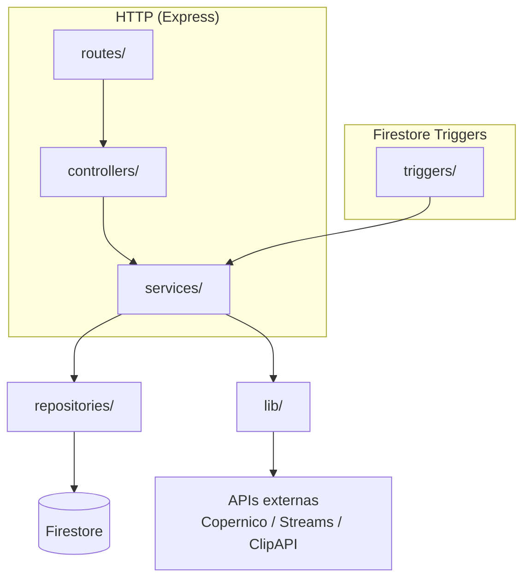

# Arquitectura general — Live / Copernico

## ¿Qué hace este sistema?

Backend en tiempo real para seguimiento de atletas en carreras. Recibe eventos de cronometraje del sistema externo **Copernico** vía webhook, los procesa en una cola Firestore, genera **stories** (registros de paso por checkpoint), opcionalmente un **video clip**, y envía **push notifications** a los seguidores del atleta.

## Stack

| Pieza | Tecnología |
|-------|-----------|
| Runtime | Node.js 22 (ESM — `"type": "module"`) |
| Plataforma | Firebase Cloud Functions v2 |
| Base de datos | Cloud Firestore (Admin SDK, sin acceso cliente directo) |
| Notificaciones | Firebase Cloud Messaging (FCM) |
| Vídeo | API externa `generateSingleClipFromChunks` en proyecto `copernico-jv5v73` |
| Streams | API externa `streams.timingsense.cloud` |
| Tareas diferidas | Google Cloud Tasks (cola `trophy-verification`) |
| Proyecto Firebase | `live-copernico` |

## Codebases

Hay **dos codebases** desplegadas en el mismo proyecto Firebase. Solo la v2 está activa para desarrollo nuevo:

| | `functions/` | `functions_v2/` ✅ activa |
|---|---|---|
| Función HTTP | `liveApiGateway` | `liveApiGatewayV2` |
| Base path | `/api` | `/api-v2` |
| Estructura | Monolítica (módulos planos) | MVC limpio |
| Estado | Legacy / mantenimiento | Desarrollo activo |

> Todo el código nuevo va en `functions_v2/`. No tocar `functions/` salvo hotfix urgente.

## Estructura de `functions_v2/`

```
functions_v2/
├── index.mjs                  # Entry point: exporta función HTTP + triggers
├── src/
│   ├── app.mjs                # Express app (buildApp)
│   ├── routes/                # Definición HTTP (Express Router por dominio)
│   ├── controllers/           # Parse request → llama service → envía respuesta
│   ├── services/              # Lógica de negocio
│   ├── repositories/          # Acceso a Firestore (ParticipantRepository, StoryRepository, QueueRepository)
│   ├── lib/                   # Utilidades compartidas (auth, http, firestorePaths, normalizeUtf8, copernicoService…)
│   └── triggers/              # Triggers Firestore (onDocumentCreated)
```

## Capas y responsabilidades



**Regla de capas:** las rutas no llaman a repositories directamente. Los controllers no contienen lógica de negocio. Los services no construyen respuestas HTTP.

## Funciones exportadas (`index.mjs`)

```
liveApiGatewayV2              → onRequest(Express app) — base /api-v2
onCheckpointQueueCreatedV2    → onDocumentCreated: processing_queue/{queueKey}
onCheckpointQueueJobCreatedV2 → onDocumentCreated: processing_queue_jobs/{jobId}
onClipGenerationJobCreatedV2  → onDocumentCreated: clip_generation_jobs/{jobId}
onEventWrittenV2              → onDocumentWritten: races/{raceId}/apps/{appId}/events/{eventId}
```

## Variables de entorno clave

| Variable | Uso | Default |
|----------|-----|---------|
| `WEBHOOK_API_KEY` | Autenticación de todos los endpoints | — (obligatorio) |
| `COPERNICO_ENV` | Entorno Copernico activo (`pro`/`demo`/`dev`/`alpha`) | `pro` |
| `COPERNICO_PROD_API_KEY` | Token para Copernico producción | — |
| `COPERNICO_DEMO_API_KEY` | Token para Copernico demo | — |
| `COPERNICO_TIMEOUT_MS` | Timeout requests Copernico | `10000` |
| `STREAMS_BASE_URL` | URL base API de streams de vídeo | `https://streams.timingsense.cloud` |
| `QUEUE_PROCESS_TIMEOUT_MS` | Timeout trigger cola | `180000` |
| `QUEUE_JOB_PROCESS_TIMEOUT_MS` | Timeout trigger job | `300000` |
| `CLEANUP_EVENT_COPERNICO` | Activa limpieza diaria (`true`/`false`) | `false` |
| `TROPHY_ENDPOINT_URL` | URL del endpoint de trofeos | — |
| `CLOUD_TASKS_QUEUE` | Nombre de la cola Cloud Tasks | `trophy-verification` |
| `TROPHY_DELAY_SECONDS` | Retraso antes de verificar trofeos | `30` |

## Ver también

- [02-firestore-schema.md](./02-firestore-schema.md) — Colecciones y estructura de documentos
- [03-checkpoint-flow.md](./03-checkpoint-flow.md) — Flujo completo de un checkpoint
- [04-copernico.md](./04-copernico.md) — Integración con el sistema de cronometraje
- [05-stories-notifications.md](./05-stories-notifications.md) — Stories, clips y notificaciones
- [06-auth-and-api.md](./06-auth-and-api.md) — Autenticación y convenciones de API
