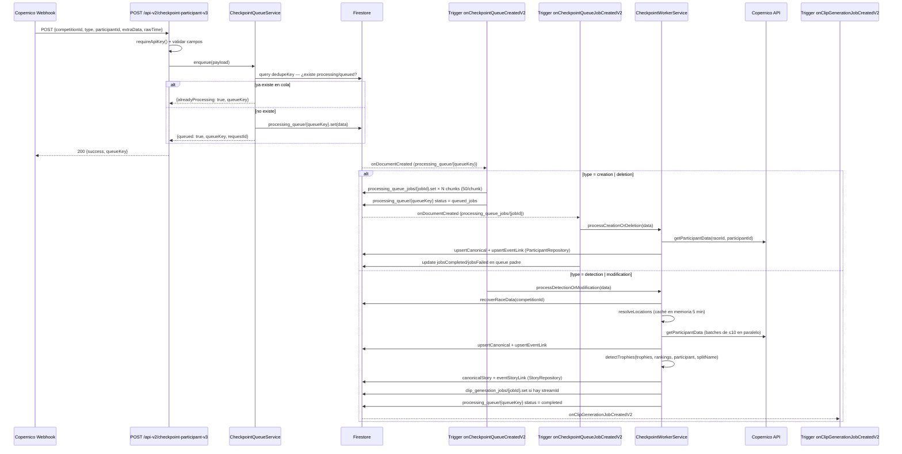

# Flujo de checkpoint — de webhook a story

Este es el flujo central del sistema. Ocurre cada vez que un atleta pasa por un punto de control durante una carrera.

## Diagrama de secuencia



## Tipos de evento (`type`)

| Tipo | Significado | Ruta en el worker |
|------|-------------|-------------------|
| `detection` | Atleta detectado en punto de control | `processDetectionOrModification` → crea story |
| `modification` | Actualización de un paso ya registrado | `processDetectionOrModification` → actualiza story |
| `creation` | Alta de participante en la carrera | `processCreationOrDeletion` → crea/actualiza participante |
| `deletion` | Baja de participante | `processCreationOrDeletion` → elimina participante |

## Deduplicación

`CheckpointQueueService` (`src/services/checkpointQueueService.mjs`) construye una `dedupeKey`:

```
{COMPETITION_ID}_{PARTICIPANT_ID}_{TYPE}_{POINT}_{LOCATION}_V2
```

Antes de crear un nuevo doc en `processing_queue`, consulta si ya existe uno con ese `dedupeKey` y status `queued | queued_jobs | processing`. Si existe, devuelve `alreadyProcessing: true` sin crear duplicado.

## Resolución de localizaciones

El worker necesita saber en qué `{raceId, appId, eventId}` vive el participante. Lo resuelve consultando Firestore con un **caché en memoria de 5 minutos** (`EVENT_CACHE_TTL_MS = 5 * 60 * 1000`). Si no encuentra ningún evento, marca el queue doc como `completed_no_events` y para.

## Chunks para creation/deletion

Los tipos `creation` y `deletion` pueden traer arrays de cientos de participantes. El servicio los divide en chunks de 50 (`CHUNK_SIZE = 50`) y crea un doc en `processing_queue_jobs` por cada chunk. El trigger `onCheckpointQueueJobCreatedV2` procesa cada job de forma independiente y actualiza los contadores `jobsCompleted`/`jobsFailed` en el doc padre de la cola.

## Archivos clave

| Responsabilidad | Archivo |
|-----------------|---------|
| Ruta HTTP | `src/routes/checkpoint.routes.mjs` |
| Controller (parse/validación) | `src/controllers/checkpointController.mjs` |
| Enqueue + dedup | `src/services/checkpointQueueService.mjs` |
| Lógica de procesamiento | `src/services/checkpointWorkerService.mjs` |
| Triggers Firestore | `src/triggers/checkpointQueueTriggers.mjs` |
| Acceso Firestore | `src/repositories/participantRepository.mjs`<br>`src/repositories/storyRepository.mjs`<br>`src/repositories/queueRepository.mjs` |
| Paths Firestore | `src/lib/firestorePaths.mjs` |
| Datos de carrera | `src/lib/raceData.mjs` → `recoverRaceData(db, competitionId)` |
| Streams de vídeo | `src/lib/competitionStreams.mjs` → `resolveStreamIdLikeInitial()` |

## Timeouts y TTL

| Config | Variable de entorno | Default |
|--------|---------------------|---------|
| Timeout trigger cola | `QUEUE_PROCESS_TIMEOUT_MS` | 180 s |
| Timeout trigger job | `QUEUE_JOB_PROCESS_TIMEOUT_MS` | 300 s |
| TTL docs completados en `processing_queue` | — | 15 min (`expireAt`) |
| Caché de resolución de eventos | `EVENT_CACHE_TTL_MS` (hardcoded) | 5 min |
