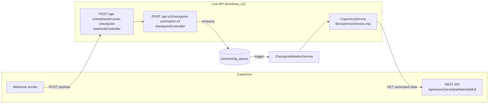

# Integración con Copernico

Copernico es el sistema externo de cronometraje que genera los eventos de paso de atletas. La integración tiene dos canales: **webhook entrante** (Copernico → nosotros) y **API REST saliente** (nosotros → Copernico para obtener datos del participante).

## Arquitectura de la integración



## Entornos

`CopernicoConfig` (`src/lib/copernicoConfig.mjs`) gestiona 4 entornos. El activo se controla con `COPERNICO_ENV`:

| Entorno | URL base | Variable de token |
|---------|----------|-------------------|
| `pro` (default) | `https://public-api.copernico.cloud/api/races` | `COPERNICO_PROD_API_KEY` |
| `demo` | `https://demo-api.copernico.cloud/api/races` | `COPERNICO_DEMO_API_KEY` |
| `dev` | `http://copernico.local.sportmaniacs.com/api/races` | `COPERNICO_DEV_API_KEY` |
| `alpha` | `https://psexjdg973.execute-api.eu-west-1.amazonaws.com/alpha/api/races` | `COPERNICO_ALPHA_API_KEY` |

El entorno puede sobreescribirse por carrera: si el documento `races/{raceId}` tiene el campo `copernicoEnv`, se usa ese en vez del global. Esto lo lee `recoverRaceData()` en `src/lib/raceData.mjs`.

## URL del endpoint de participante

```
GET {baseUrl}/{raceId}/athlete/{participantId}/full
Headers:
  x-api-key: {token}
  Content-Type: application/json
  User-Agent: LiveCopernico-API/1.0
  Accept: application/json
```

Construida por `CopernicoConfig.getApiUrl(raceId, participantId, env)`.

## CopernicoService (`src/lib/copernicoService.mjs`)

```js
getParticipantData(raceId, participantId, envOverride?, options?)
```

- Timeout configurable via `COPERNICO_TIMEOUT_MS` (default 10 s), implementado con `AbortController`
- Caché en memoria **deshabilitado por defecto** (`cache.enableCache = false`)
- `options.forceRefresh = true` para saltarse la caché explícitamente
- Reintentos configurables: `COPERNICO_RETRY_ATTEMPTS` (default 3), `COPERNICO_RETRY_DELAY_MS` (default 1000 ms)

El worker procesa participantes en batches de máximo 10 en paralelo (`COPERNICO_BATCH_SIZE = 10`) para no saturar la API.

## Webhook entrante

El webhook de Copernico llega a `POST /api-v2/webhook/runner-checkpoint`. El controller lo redirige internamente a la misma lógica que `checkpointController`.

### Payload del webhook

```json
{
  "competitionId": "string",    // ID de la competición en Copernico
  "copernicoId": "string",      // ID interno de Copernico (puede diferir del participantId)
  "type": "detection | modification | creation | deletion",
  "participantId": "string",    // para detection/modification
  "participantsIds": ["string"],// para creation/deletion (batch)
  "event": "string | object",   // hint del evento/split (puede ser mojibake)
  "extraData": {
    "point": "string",          // nombre del punto de control
    "location": "string"
  },
  "rawTime": "ISO | ms",        // timestamp del paso del atleta
  "apiKey": "string"            // autenticación
}
```

## Streams de vídeo (API complementaria)

Los streams de vídeo para generar clips se obtienen de una API separada: `streams.timingsense.cloud`.

```
GET {STREAMS_BASE_URL}/competitions/{competitionId}
Response: { data: { streams: [{ streamId, name }] } }
```

`resolveStreamIdLikeInitial()` en `src/lib/competitionStreams.mjs` mapea el nombre del checkpoint al `streamId` UUID correspondiente usando normalización de texto (minúsculas + sin acentos). Caché en memoria de `STREAMS_CACHE_TTL_MS` (default 60 s).

Alias especiales en el mapa de streams:
- `meta` → también registrado como `finish`
- `salida` → también registrado como `start`

## Normalización UTF-8 (mojibake)

Los datos de Copernico llegan frecuentemente con double-encoded UTF-8 (ej: `ó` en vez de `ó`). La normalización se aplica en múltiples capas:

| Función | Archivo | Uso |
|---------|---------|-----|
| `normalizeUTF8InObject(obj)` | `src/lib/normalizeUtf8.mjs` | Normaliza recursivamente todos los strings de un objeto |
| `normalizeEventKey(str)` | `src/lib/normalizeUtf8.mjs` | Normaliza para comparar IDs de evento (minúsculas + sin acentos) |
| `normalizeComparableKey(str)` | `src/lib/normalizeUtf8.mjs` | Comparación general insensible a encoding |
| `hasMojibake(value)` | `src/services/checkpointWorkerService.mjs` | Detecta secuencias `Ã\|Â\|` para decidir si re-normalizar |

Siempre usar `normalizeEventKey` al comparar IDs de evento provenientes de Copernico contra los almacenados en Firestore.
