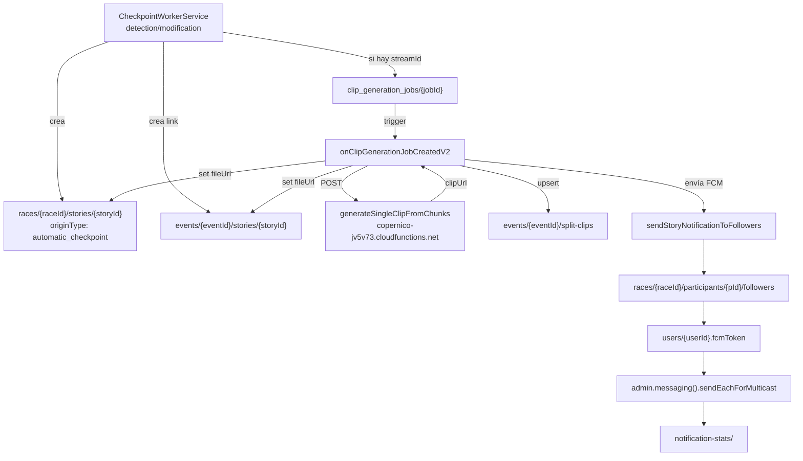

# Stories, clips de vídeo y notificaciones

## Visión general del pipeline



## Story (`originType: automatic_checkpoint`)

Creada por `CheckpointWorkerService` en el flujo de `detection/modification`. El `storyId` se genera a partir de un **hash SHA-1 estable** de `{raceId}|{appId}|{eventId}|{participantId}|{splitName}` para garantizar idempotencia: si el mismo checkpoint llega dos veces, la story se actualiza en lugar de duplicarse.

### Tipos de story (`type`)

| Valor | Cuándo |
|-------|--------|
| `ATHLETE_CROSSED_TIMING_SPLIT` | Paso por checkpoint intermedio |
| `ATHLETE_STARTED` | Paso por el punto de salida |
| `ATHLETE_FINISHED` | Paso por meta |

## Generación de clip de vídeo

Si el worker resuelve un `streamId` para el checkpoint, crea un doc en `clip_generation_jobs/{jobId}`.

**Campos obligatorios del job** (si faltan, el trigger falla con `status: failed`):
- `storyRefPath` — path al doc canónico de la story
- `eventStoryRefPath` — path al link evento-story
- `streamId` — UUID del stream

El trigger `onClipGenerationJobCreatedV2` (`src/triggers/clipGenerationTrigger.mjs`) procesa el job:

1. `ClipGenerationService.buildClipRequest()` — calcula ventana de tiempo ±20 s alrededor de `checkpointRawTime`
2. `ClipGenerationService.generateStoryVideoClip()` — llama a la API externa
3. Actualiza `fileUrl` en la story canónica y en el link de evento (`storyRefPath` y `eventStoryRefPath`)
4. `ClipGenerationService.createSplitClip()` — upserta en `events/{eventId}/split-clips`
5. `ClipGenerationService.sendStoryNotificationToFollowers()` — envía FCM con el clip

**API externa de clips:**
```
POST https://us-central1-copernico-jv5v73.cloudfunctions.net/generateSingleClipFromChunks
Body: { streamId, startTime, endTime, concatenationMethod: "playlist", includeIntro: false }
Response: { clipUrl, fileName }
```

## Sistema de trofeos

`TrophyStoryService` (`src/services/trophyStoryService.mjs`) detecta si el atleta merece un trofeo al cruzar un split.

**Detección:** `detectTrophies()` en `src/lib/trophyDetection.mjs` compara la posición del atleta (general / género / categoría) con umbrales configurados en el evento (`trophies` array).

**Creación diferida:** si se detectan trofeos potenciales, se encola una tarea en **Google Cloud Tasks** con retraso de `TROPHY_DELAY_SECONDS` (default 30 s). El retraso permite que los rankings se estabilicen antes de verificar definitivamente la posición.

**Endpoint receptor:** `POST /api-v2/trophy-story-creation` (protegido por `WEBHOOK_API_KEY`)

El `storyId` del trofeo es estable: `st_trophy_{sha1(raceId|appId|eventId|participantId|trophyKey).slice(0,24)}`

## Notificaciones FCM

Gestionadas por `ClipGenerationService.sendStoryNotificationToFollowers()`.

**Flujo:**
1. Leer `races/{raceId}/participants/{participantId}/followers` — lista de `userId`
2. Leer `users/{userId}.fcmToken` para cada follower
3. Filtrar tokens nulos
4. Enviar en chunks de 500 (`admin.messaging().sendEachForMulticast`)
5. Guardar estadísticas en `notification-stats/`

**Payload FCM:**

```js
{
  notification: { title, body, imageUrl? },
  data: {
    notificationType: "STORY_CLIP_READY" | "NEW_STORY",
    storyId, participantId, raceId, appId, eventId,
    storyType, participantName, participantDorsal,
    checkpointTime, checkpointName, mediaUrl, mediaType,
    storyMeta: JSON.stringify({...}) // compact para deep-link en la app
  },
  android: {
    priority: "high",
    notification: { channelId: "story_notifications", color: "#FF6B35" }
  },
  apns: {
    payload: { aps: { category: "STORY_NOTIFICATION", "mutable-content": 1 } }
  }
}
```

**Emojis en el título por tipo:**
- `ATHLETE_STARTED` → 🚀
- `ATHLETE_FINISHED` → 🏁
- `ATHLETE_CROSSED_TIMING_SPLIT` → ⏱️

## Trigger `onStoryCreated` (legacy v1)

El trigger de v1 en `functions/triggers/storyNotificationTrigger.mjs` sigue activo y escucha `races/{raceId}/apps/{appId}/events/{eventId}/participants/{participantId}/stories/{storyId}`.

**Omite stories con `originType === "automatic_checkpoint"`** para evitar notificaciones duplicadas — el flujo v2 ya notifica desde el job de clip. Solo actúa sobre stories creadas manualmente u otros `originType`.
