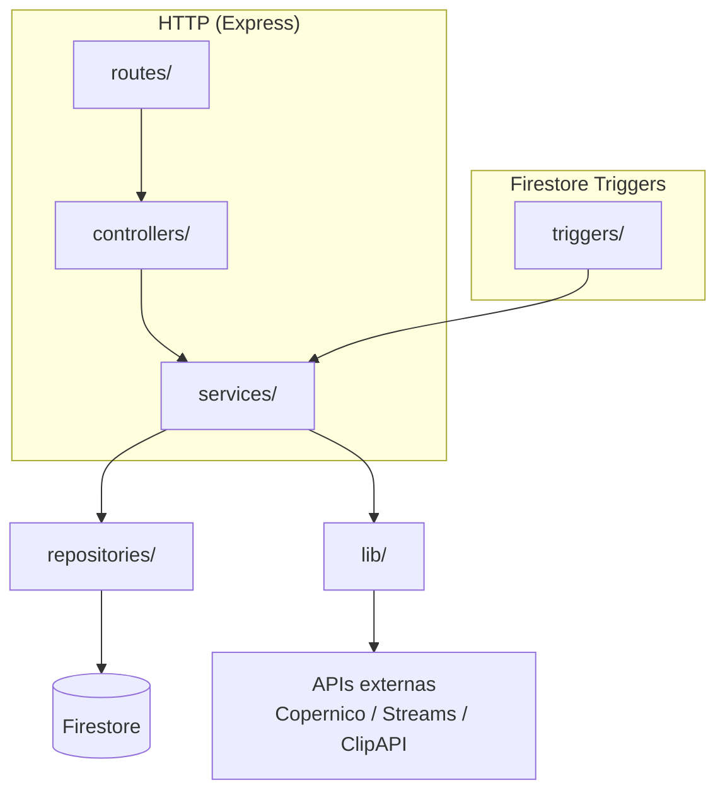
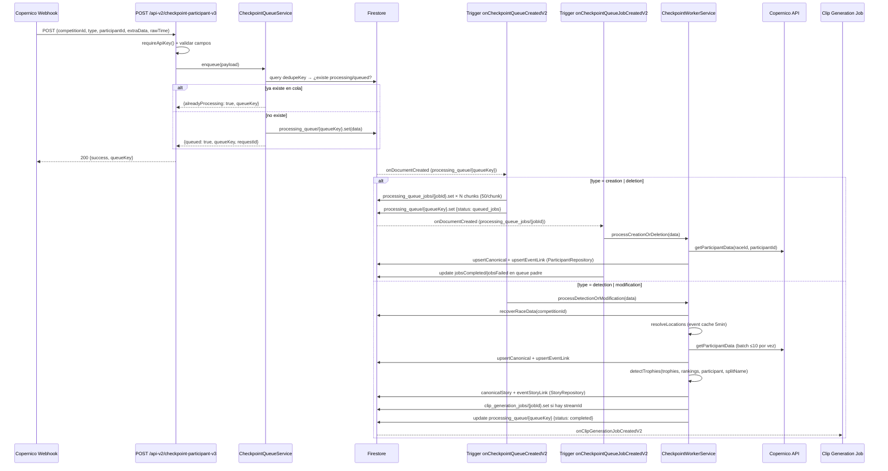

# Architecture Documentation Implementation Plan

> **For agentic workers:** REQUIRED SUB-SKILL: Use superpowers:subagent-driven-development (recommended) or superpowers:executing-plans to implement this plan task-by-task. Steps use checkbox (`- [ ]`) syntax for tracking.

**Goal:** Crear 6 documentos de arquitectura en `docs/architecture/` que sirvan como referencia navegable para nuevos devs y Claude Code, actualizando `CLAUDE.md` con un índice al final.

**Architecture:** Documentación pura — cada doc es un archivo Markdown independiente con diagramas Mermaid. No hay código que modificar. El orden importa: overview primero (referencia para el resto), schema segundo (usado en todos los flujos), luego flujos de negocio.

**Tech Stack:** Markdown, Mermaid, Firebase Functions v2 (Node.js ESM), Firestore, Cloud Tasks, FCM

---

### Task 1: Crear `docs/architecture/01-overview.md`

**Files:**
- Create: `docs/architecture/01-overview.md`

- [ ] **Step 1: Crear el directorio**

```bash
mkdir -p docs/architecture
```

- [ ] **Step 2: Escribir el documento**

Contenido exacto a escribir en `docs/architecture/01-overview.md`:

````markdown
# Arquitectura general — Live / Copernico

## ¿Qué hace este sistema?

Backend en tiempo real para seguimiento de atletas en carreras. Recibe eventos de cronometraje del sistema externo **Copernico** vía webhook, los procesa en una cola Firestore, genera **stories** (registros de paso por checkpoint), opcionalmente un **video clip**, y envía **push notifications** a los seguidores del atleta.

## Stack

| Pieza | Tecnología |
|-------|-----------|
| Runtime | Node.js 22 (ESM — `"type": "module"`) |
| Plataforma | Firebase Cloud Functions v2 |
| Base de datos | Cloud Firestore (Admin SDK, sin acceso cliente directo) |
| Notificaciones | Firebase Cloud Messaging (FCM) |
| Vídeo | API externa `generateSingleClipFromChunks` en `copernico-jv5v73` |
| Streams | API externa `streams.timingsense.cloud` |
| Tareas diferidas | Google Cloud Tasks (cola `trophy-verification`) |
| Proyecto Firebase | `live-copernico` |

## Codebases

Hay **dos codebases** desplegadas en el mismo proyecto Firebase. Solo la v2 está activa para desarrollo nuevo:

| | `functions/` | `functions_v2/` ✅ activa |
|---|---|---|
| Función HTTP | `liveApiGateway` | `liveApiGatewayV2` |
| Base path | `/api` | `/api-v2` |
| Estructura | Monolítica (módulos planos) | MVC limpio |
| Estado | Legacy / mantenimiento | Desarrollo activo |

> Todo el código nuevo va en `functions_v2/`. No tocar `functions/` salvo hotfix urgente.

## Estructura de `functions_v2/`

```
functions_v2/
├── index.mjs                  # Entry point: exporta función HTTP + triggers
├── src/
│   ├── app.mjs                # Express app (buildApp)
│   ├── routes/                # Definición HTTP (Express Router por dominio)
│   ├── controllers/           # Parse request → llama service → envía respuesta
│   ├── services/              # Lógica de negocio
│   ├── repositories/          # Acceso a Firestore (ParticipantRepository, StoryRepository, QueueRepository)
│   ├── lib/                   # Utilidades compartidas (auth, http, firestorePaths, normalizeUtf8, copernicoService…)
│   └── triggers/              # Triggers Firestore (onDocumentCreated)
```

## Capas y responsabilidades



**Regla de capas:** las rutas no llaman a repositories directamente. Los controllers no contienen lógica de negocio. Los services no construyen respuestas HTTP.

## Funciones exportadas (`index.mjs`)

```
liveApiGatewayV2              → onRequest(Express app) — base /api-v2
onCheckpointQueueCreatedV2    → onDocumentCreated: processing_queue/{queueKey}
onCheckpointQueueJobCreatedV2 → onDocumentCreated: processing_queue_jobs/{jobId}
onClipGenerationJobCreatedV2  → onDocumentCreated: clip_generation_jobs/{jobId}
onEventWrittenV2              → onDocumentWritten: races/{raceId}/apps/{appId}/events/{eventId}
```

## Variables de entorno clave

| Variable | Uso | Default |
|----------|-----|---------|
| `WEBHOOK_API_KEY` | Autenticación de todos los endpoints | — (obligatorio) |
| `COPERNICO_ENV` | Entorno Copernico activo (`pro`/`demo`/`dev`/`alpha`) | `pro` |
| `COPERNICO_PROD_API_KEY` | Token para Copernico producción | — |
| `COPERNICO_DEMO_API_KEY` | Token para Copernico demo | — |
| `COPERNICO_TIMEOUT_MS` | Timeout requests Copernico | `10000` |
| `STREAMS_BASE_URL` | URL base API de streams de vídeo | `https://streams.timingsense.cloud` |
| `QUEUE_PROCESS_TIMEOUT_MS` | Timeout trigger cola | `180000` |
| `QUEUE_JOB_PROCESS_TIMEOUT_MS` | Timeout trigger job | `300000` |
| `CLEANUP_EVENT_COPERNICO` | Activa limpieza diaria (`true`/`false`) | `false` |
| `TROPHY_ENDPOINT_URL` | URL del endpoint de trofeos | — |
| `CLOUD_TASKS_QUEUE` | Nombre de la cola Cloud Tasks | `trophy-verification` |
| `TROPHY_DELAY_SECONDS` | Retraso antes de verificar trofeos | `30` |

## Ver también

- [02-firestore-schema.md](./02-firestore-schema.md) — Colecciones y estructura de documentos
- [03-checkpoint-flow.md](./03-checkpoint-flow.md) — Flujo completo de un checkpoint
- [04-copernico.md](./04-copernico.md) — Integración con el sistema de cronometraje
- [05-stories-notifications.md](./05-stories-notifications.md) — Stories, clips y notificaciones
- [06-auth-and-api.md](./06-auth-and-api.md) — Autenticación y convenciones de API
````

- [ ] **Step 3: Commit**

```bash
git add docs/architecture/01-overview.md
git commit -m "docs: add architecture overview (01-overview)"
```

---

### Task 2: Crear `docs/architecture/02-firestore-schema.md`

**Files:**
- Create: `docs/architecture/02-firestore-schema.md`

- [ ] **Step 1: Escribir el documento**

Contenido exacto a escribir en `docs/architecture/02-firestore-schema.md`:

````markdown
# Firestore — Schema y rutas de colecciones

> Todas las rutas son accedidas exclusivamente vía Admin SDK en Cloud Functions. Las reglas de Firestore deniegan todo acceso directo desde cliente.

## Modelo canónico v2

El modelo v2 separa los **documentos canónicos** (fuente de verdad) de los **links por evento/app** (índices de navegación). Los paths canónicos están definidos en `functions_v2/src/lib/firestorePaths.mjs`.

```
races/{raceId}
├── participants/{participantId}          ← Participante canónico
│   └── followers/{userId}               ← Usuarios que siguen al participante
├── stories/{storyId}                    ← Story canónica
│   ├── likes/{userId}
│   └── shares/{userId}
└── apps/{appId}
    └── events/{eventId}
        ├── participants/{participantId}  ← Link evento-participante
        └── stories/{storyId}            ← Link evento-story
```

### Participante canónico — `races/{raceId}/participants/{participantId}`

Campos principales (escritos por `ParticipantRepository.upsertCanonical`):

| Campo | Tipo | Descripción |
|-------|------|-------------|
| `participantId` | string | ID externo de Copernico |
| `raceId` | string | ID de la carrera |
| `dorsal` | string | Número de dorsal |
| `fullName` | string | Nombre completo normalizado UTF-8 |
| `gender` | string | `M` / `F` |
| `category` | string | Categoría de competición |
| `featured` | boolean | Participante destacado |
| `updatedAt` | Timestamp | Última actualización (serverTimestamp) |

### Story canónica — `races/{raceId}/stories/{storyId}`

| Campo | Tipo | Descripción |
|-------|------|-------------|
| `storyId` | string | ID del documento |
| `raceId` | string | ID de la carrera |
| `participantId` | string | ID del participante |
| `model` | `"canonical_story_v2"` | Marca de versión |
| `originType` | string | `automatic_checkpoint` / `automatic_global` / `trophy` |
| `type` | string | `ATHLETE_CROSSED_TIMING_SPLIT` / `ATHLETE_STARTED` / `ATHLETE_FINISHED` |
| `split_time` | object | `{ checkpoint, time }` |
| `fileUrl` | string | URL del clip de vídeo (relleno después por clip job) |
| `moderationStatus` | string | `approved` / `pending` / `rejected` |
| `createdAt` / `updatedAt` | Timestamp | serverTimestamp |

### Link evento-participante — `races/{raceId}/apps/{appId}/events/{eventId}/participants/{participantId}`

Escrito por `ParticipantRepository.upsertEventLink`. Contiene un subconjunto de campos del canónico más:

| Campo | Tipo |
|-------|------|
| `participantRefPath` | string — path al doc canónico |
| `appId`, `eventId` | string |

### Link evento-story — `races/{raceId}/apps/{appId}/events/{eventId}/stories/{storyId}`

Escrito por `StoryRepository.upsertEventStoryLink`. Contiene:

| Campo | Tipo |
|-------|------|
| `storyRefPath` | string — path al doc canónico |
| `participantId`, `appId`, `eventId`, `raceId`, `storyId` | string |

## Colecciones de sistema

### `processing_queue/{queueKey}` — Cola de checkpoints

| Campo | Descripción |
|-------|-------------|
| `dedupeKey` | Clave para evitar duplicados: `COMPETITIONID_PARTICIPANTID_TYPE_POINT_LOCATION_V2` |
| `queueKey` | `dedupeKey + "_" + timestamp` |
| `requestId` | ID único del request |
| `type` | `detection` / `modification` / `creation` / `deletion` |
| `status` | `queued` / `queued_jobs` / `processing` / `completed` / `completed_skipped` / `failed` |
| `expireAt` | Timestamp de TTL (15 min tras completar) |
| `jobsTotal` / `jobsCompleted` / `jobsFailed` | Contadores para tipo `creation/deletion` |

### `processing_queue_jobs/{jobId}` — Jobs de creación/eliminación batch

Creados cuando `type = creation | deletion`. Un job por chunk de 50 participantes (`CHUNK_SIZE = 50`).

| Campo | Descripción |
|-------|-------------|
| `queueKey` | Referencia al doc padre en `processing_queue` |
| `type` | `creation` / `deletion` |
| `participantsIds` | Array de IDs del chunk |
| `status` | `queued` / `processing` / `completed` / `failed` |

### `clip_generation_jobs/{jobId}` — Jobs de generación de vídeo

| Campo | Descripción |
|-------|-------------|
| `storyRefPath` | Path al doc canónico de la story |
| `eventStoryRefPath` | Path al link evento-story |
| `streamId` | UUID del stream de vídeo |
| `checkpointRawTime` | Timestamp del paso del atleta (ms o ISO) |
| `checkpointId` | Nombre del punto de control |
| `status` | `queued` / `processing` / `completed` / `failed` |
| `clipUrl` | URL resultante (relleno al completar) |

### `races/{raceId}/apps/{appId}/events/{eventId}/split-clips/{docId}` — Clips por split

Escrito por `ClipGenerationService.createSplitClip`. Un doc por combinación `(splitName, participantId)`.

### `notification-stats/{docId}` — Estadísticas de notificaciones

Log de cada envío FCM. Escrito por `ClipGenerationService.saveNotificationStats`.

### `users/{userId}` — Usuarios

Campo relevante: `fcmToken` (string) — token FCM para push notifications.

## Path helpers (`firestorePaths.mjs`)

```js
raceRef(db, raceId)
appRef(db, raceId, appId)
eventRef(db, raceId, appId, eventId)
canonicalParticipantRef(db, raceId, participantId)
eventParticipantLinkRef(db, raceId, appId, eventId, participantId)
canonicalStoryRef(db, raceId, storyId)
eventStoryLinkRef(db, raceId, appId, eventId, storyId)
```
````

- [ ] **Step 2: Commit**

```bash
git add docs/architecture/02-firestore-schema.md
git commit -m "docs: add Firestore schema reference (02-firestore-schema)"
```

---

### Task 3: Crear `docs/architecture/03-checkpoint-flow.md`

**Files:**
- Create: `docs/architecture/03-checkpoint-flow.md`

- [ ] **Step 1: Escribir el documento**

Contenido exacto a escribir en `docs/architecture/03-checkpoint-flow.md`:

````markdown
# Flujo de checkpoint — de webhook a story

Este es el flujo central del sistema. Ocurre cada vez que un atleta pasa por un punto de control durante una carrera.

## Diagrama de secuencia



## Tipos de evento (`type`)

| Tipo | Significado | Ruta en el worker |
|------|-------------|-------------------|
| `detection` | Atleta detectado en punto de control | `processDetectionOrModification` → crea story |
| `modification` | Actualización de datos de un paso ya registrado | `processDetectionOrModification` → actualiza story |
| `creation` | Alta de participante en la carrera | `processCreationOrDeletion` → crea/actualiza participante |
| `deletion` | Baja de participante | `processCreationOrDeletion` → elimina participante |

## Deduplicación

`CheckpointQueueService` construye una `dedupeKey`:

```
{COMPETITION_ID}_{PARTICIPANT_ID}_{TYPE}_{POINT}_{LOCATION}_V2
```

Antes de crear un nuevo doc en `processing_queue`, consulta si ya existe uno con ese `dedupeKey` y status `queued | queued_jobs | processing`. Si existe, devuelve `alreadyProcessing: true` sin crear duplicado.

## Resolución de localizaciones (event resolution)

El worker necesita saber en qué `{raceId, appId, eventId}` vive el participante. Lo resuelve consultando Firestore con un caché en memoria de 5 minutos (`EVENT_CACHE_TTL_MS`). Si no encuentra ningún evento, marca el queue doc como `completed_no_events` y para.

## Archivos clave

| Responsabilidad | Archivo |
|-----------------|---------|
| Ruta HTTP | `src/routes/checkpoint.routes.mjs` |
| Controller (parse/validación) | `src/controllers/checkpointController.mjs` |
| Enqueue + dedup | `src/services/checkpointQueueService.mjs` |
| Lógica del worker | `src/services/checkpointWorkerService.mjs` |
| Triggers Firestore | `src/triggers/checkpointQueueTriggers.mjs` |
| Acceso Firestore | `src/repositories/participantRepository.mjs`, `src/repositories/storyRepository.mjs`, `src/repositories/queueRepository.mjs` |
| Rutas Firestore | `src/lib/firestorePaths.mjs` |
| Datos de carrera | `src/lib/raceData.mjs` → `recoverRaceData(db, competitionId)` |
| Streams de vídeo | `src/lib/competitionStreams.mjs` → `resolveStreamIdLikeInitial()` |

## Timeouts

- Trigger `onCheckpointQueueCreatedV2`: `QUEUE_PROCESS_TIMEOUT_MS` (default 180s)
- Trigger `onCheckpointQueueJobCreatedV2`: `QUEUE_JOB_PROCESS_TIMEOUT_MS` (default 300s)
- TTL de docs completados en `processing_queue`: 15 minutos (`expireAt`)
````

- [ ] **Step 2: Commit**

```bash
git add docs/architecture/03-checkpoint-flow.md
git commit -m "docs: add checkpoint processing flow (03-checkpoint-flow)"
```

---

### Task 4: Crear `docs/architecture/04-copernico.md`

**Files:**
- Create: `docs/architecture/04-copernico.md`

- [ ] **Step 1: Escribir el documento**

Contenido exacto a escribir en `docs/architecture/04-copernico.md`:

````markdown
# Integración con Copernico

Copernico es el sistema externo de cronometraje que genera los eventos de paso de atletas. La integración tiene dos canales: **webhook entrante** (Copernico → nosotros) y **API REST saliente** (nosotros → Copernico para obtener datos del participante).

## Arquitectura de la integración

```mermaid
graph LR
    subgraph Copernico
        CW[Webhook sender]
        CAPI[REST API\n/api/races/{raceId}/athlete/{id}/full]
    end

    subgraph "Live API (functions_v2)"
        WH[POST /api-v2/webhook/runner-checkpoint\nwebhookController]
        CP[POST /api-v2/checkpoint-participant-v3\ncheckpointController]
        CS[CopernicoService\nlib/copernicoService.mjs]
    end

    CW -->|"POST {competitionId, type, participantId}"| WH
    WH --> CP
    CP -->|enqueue| FS[(processing_queue)]
    FS -->|trigger| WK[CheckpointWorkerService]
    WK --> CS
    CS -->|GET participant data| CAPI
```

## Entornos

`CopernicoConfig` (`src/lib/copernicoConfig.mjs`) gestiona 4 entornos. El activo se controla con `COPERNICO_ENV`:

| Entorno | URL base | Variable de token |
|---------|----------|-------------------|
| `pro` (default) | `https://public-api.copernico.cloud/api/races` | `COPERNICO_PROD_API_KEY` |
| `demo` | `https://demo-api.copernico.cloud/api/races` | `COPERNICO_DEMO_API_KEY` |
| `dev` | `http://copernico.local.sportmaniacs.com/api/races` | `COPERNICO_DEV_API_KEY` |
| `alpha` | `https://psexjdg973.execute-api.eu-west-1.amazonaws.com/alpha/api/races` | `COPERNICO_ALPHA_API_KEY` |

El entorno puede sobreescribirse por carrera — si el documento `races/{raceId}` tiene el campo `copernicoEnv`, se usa ese en vez del global.

## URL del endpoint de participante

```
GET {baseUrl}/{raceId}/athlete/{participantId}/full
Headers:
  x-api-key: {token}
  Content-Type: application/json
  User-Agent: LiveCopernico-API/1.0
```

Construida por `CopernicoConfig.getApiUrl(raceId, participantId, env)`.

## CopernicoService (`src/lib/copernicoService.mjs`)

```
getParticipantData(raceId, participantId, envOverride?, options?)
  → retorna datos del atleta normalizados
  → timeout configurable via COPERNICO_TIMEOUT_MS (default 10s)
  → cache en memoria deshabilitado por defecto (cache.enableCache = false)
  → options.forceRefresh = true para saltarse caché
```

El worker procesa participantes en batches de máximo 10 en paralelo (`COPERNICO_BATCH_SIZE = 10`) para no saturar la API.

## Webhook entrante

El webhook de Copernico llega a `POST /api-v2/webhook/runner-checkpoint` (también disponible en el path heredado del v1). El controller lo redirige internamente a la misma lógica de `checkpointController`.

### Payload del webhook

```json
{
  "competitionId": "string",   // ID de la competición en Copernico
  "copernicoId": "string",     // ID interno de Copernico (puede diferir del participantId)
  "type": "detection | modification | creation | deletion",
  "participantId": "string",   // para detection/modification
  "participantsIds": ["string"],// para creation/deletion (batch)
  "event": "string | object",  // hint del evento/split
  "extraData": {
    "point": "string",         // nombre del punto de control
    "location": "string"
  },
  "rawTime": "ISO | ms",       // timestamp del paso
  "apiKey": "string"           // autenticación
}
```

## Streams de vídeo (complementario a Copernico)

Los streams de vídeo para generar clips se obtienen de una API separada: `streams.timingsense.cloud`.

```
GET {STREAMS_BASE_URL}/competitions/{competitionId}
```

`resolveStreamIdLikeInitial()` en `src/lib/competitionStreams.mjs` mapea el nombre del checkpoint al `streamId` UUID correspondiente. Cache en memoria de 60s (`STREAMS_CACHE_TTL_MS`).

## Normalización UTF-8

Los datos de Copernico llegan frecuentemente con mojibake (double-encoded UTF-8, ej: `ó` en vez de `ó`). La normalización se aplica:

- Al recibir el payload: `normalizeUTF8InObject()` en `src/lib/normalizeUtf8.mjs`
- Al comparar event IDs: `normalizeEventKey()` y `normalizeComparableKey()` en el mismo archivo
- La función `hasMojibake(value)` detecta las secuencias `Ã|Â|` para decidir si re-normalizar
````

- [ ] **Step 2: Commit**

```bash
git add docs/architecture/04-copernico.md
git commit -m "docs: add Copernico integration doc (04-copernico)"
```

---

### Task 5: Crear `docs/architecture/05-stories-notifications.md`

**Files:**
- Create: `docs/architecture/05-stories-notifications.md`

- [ ] **Step 1: Escribir el documento**

Contenido exacto a escribir en `docs/architecture/05-stories-notifications.md`:

````markdown
# Stories, clips de vídeo y notificaciones

## Visión general del pipeline

```mermaid
graph TD
    WK[CheckpointWorkerService\ndetection/modification] -->|crea| CS[races/{raceId}/stories/{storyId}\noriginType: automatic_checkpoint]
    WK -->|crea link| ESL[events/{eventId}/stories/{storyId}]
    WK -->|si hay streamId| CJ[clip_generation_jobs/{jobId}]

    CJ -->|trigger| CGT[onClipGenerationJobCreatedV2]
    CGT -->|POST| CAPI[generateSingleClipFromChunks\ncopernico-jv5v73.cloudfunctions.net]
    CAPI -->|clipUrl| CGT
    CGT -->|set fileUrl| CS
    CGT -->|set fileUrl| ESL
    CGT -->|upsert| SC[events/{eventId}/split-clips]
    CGT -->|envía| NOTIF[FCM push notifications]

    NOTIF --> FOL[races/{raceId}/participants/{participantId}/followers]
    FOL --> USERS[users/{userId}.fcmToken]
    USERS --> FCM[admin.messaging().sendEachForMulticast]
    FCM --> STATS[notification-stats/]
```

## Story (`originType: automatic_checkpoint`)

Creada por `CheckpointWorkerService` dentro del flujo de `detection/modification`. El `storyId` se genera a partir de un hash SHA-1 estable de `{raceId}|{appId}|{eventId}|{participantId}|{splitName}` para garantizar idempotencia (si el mismo checkpoint llega dos veces, la story se actualiza, no se duplica).

### Tipos de story (`type`)

| Valor | Cuándo |
|-------|--------|
| `ATHLETE_CROSSED_TIMING_SPLIT` | Paso por checkpoint intermedio |
| `ATHLETE_STARTED` | Paso por el punto de salida |
| `ATHLETE_FINISHED` | Paso por meta |

## Generación de clip de vídeo

Si el worker resuelve un `streamId` para el checkpoint, crea un doc en `clip_generation_jobs/{jobId}`.

**Campos obligatorios del job:**
- `storyRefPath`: path al doc canónico de la story
- `eventStoryRefPath`: path al link evento-story
- `streamId`: UUID del stream

El trigger `onClipGenerationJobCreatedV2` (`src/triggers/clipGenerationTrigger.mjs`) procesa el job:

1. Llama a `ClipGenerationService.generateStoryVideoClip()` — ventana de ±20s alrededor del `checkpointRawTime`
2. Actualiza `fileUrl` en la story canónica y en el link de evento
3. Crea/actualiza el doc en `split-clips` (`ClipGenerationService.createSplitClip`)
4. Envía notificaciones FCM con el clip adjunto (`ClipGenerationService.sendStoryNotificationToFollowers`)

**API externa de clips:**
```
POST https://us-central1-copernico-jv5v73.cloudfunctions.net/generateSingleClipFromChunks
Body: { streamId, startTime, endTime, concatenationMethod: "playlist", includeIntro: false }
Response: { clipUrl }
```

## Sistema de trofeos

`TrophyStoryService` (`src/services/trophyStoryService.mjs`) detecta si el atleta merece un trofeo al cruzar un split.

**Detección:** `detectTrophies()` en `src/lib/trophyDetection.mjs` — compara la posición del atleta (general/género/categoría) con los umbrales configurados en el evento.

**Creación diferida:** si se detectan trofeos potenciales, se encola una tarea en **Google Cloud Tasks** con un retraso de `TROPHY_DELAY_SECONDS` (default 30s). El retraso permite que los rankings se estabilicen antes de verificar definitivamente la posición.

**Endpoint receptor:** `POST /api-v2/trophy-story-creation` (protegido por `WEBHOOK_API_KEY`)

El `storyId` del trofeo es estable: `st_trophy_{sha1(raceId|appId|eventId|participantId|trophyKey).slice(0,24)}`

## Notificaciones FCM

Gestionadas por `ClipGenerationService.sendStoryNotificationToFollowers()`.

**Flujo:**
1. Leer `races/{raceId}/participants/{participantId}/followers` — lista de `userId`
2. Leer `users/{userId}.fcmToken` para cada follower
3. Enviar en chunks de 500 tokens (`admin.messaging().sendEachForMulticast`)
4. Guardar estadísticas en `notification-stats/`

**Payload de notificación:**

```js
{
  notification: { title, body, imageUrl? },
  data: {
    notificationType: "STORY_CLIP_READY" | "NEW_STORY",
    storyId, participantId, raceId, appId, eventId,
    storyType, participantName, participantDorsal,
    checkpointTime, checkpointName, mediaUrl, mediaType,
    storyMeta: JSON.stringify({...}) // compact para deep-link
  },
  android: { priority: "high", notification: { channelId: "story_notifications" } },
  apns: { payload: { aps: { category: "STORY_NOTIFICATION", "mutable-content": 1 } } }
}
```

**Emojis por tipo de story:**
- `ATHLETE_STARTED` → 🚀
- `ATHLETE_FINISHED` → 🏁
- `ATHLETE_CROSSED_TIMING_SPLIT` → ⏱️

## Trigger `onStoryCreated` (v1 — `functions/triggers/storyNotificationTrigger.mjs`)

Este trigger de v1 sigue activo y escucha `races/{raceId}/apps/{appId}/events/{eventId}/participants/{participantId}/stories/{storyId}`. **Omite stories con `originType === "automatic_checkpoint"`** para evitar notificaciones duplicadas (el flujo v2 ya notifica desde el job de clip).
````

- [ ] **Step 2: Commit**

```bash
git add docs/architecture/05-stories-notifications.md
git commit -m "docs: add stories and notifications pipeline (05-stories-notifications)"
```

---

### Task 6: Crear `docs/architecture/06-auth-and-api.md`

**Files:**
- Create: `docs/architecture/06-auth-and-api.md`

- [ ] **Step 1: Escribir el documento**

Contenido exacto a escribir en `docs/architecture/06-auth-and-api.md`:

````markdown
# Autenticación y API HTTP

## Autenticación

Todos los endpoints están protegidos por una API key única (`WEBHOOK_API_KEY`).

### Middleware `requireApiKey()`

Definido en `src/lib/auth.mjs`. Se aplica directamente en las rutas:

```js
router.post("/checkpoint-participant-v3", requireApiKey(), checkpointParticipantV3);
router.get("/status/:key", requireApiKey({ allowBody: false }), checkpointStatus);
```

La key se extrae (en orden de prioridad):

1. `req.body.apiKey`
2. `req.headers.apikey`
3. `req.headers.apiKey`
4. `req.headers["api-key"]`

Con `allowBody: false` solo se aceptan headers (para GET requests).

### Helpers HTTP (`src/lib/http.mjs`)

```js
requireFields(source, fields[])  → string[] (campos faltantes)
sendError(res, status, message, extra?)
extractApiKey(req, { allowBody })
hasValidApiKey(req, expectedKey, { allowBody })
```

## Estructura de rutas

La app Express se monta en `/api-v2` (definido en `src/app.mjs`). El router raíz está en `src/routes/index.mjs` y agrega sub-routers por dominio:

| Dominio | Archivo de ruta | Controller |
|---------|-----------------|------------|
| Checkpoint | `checkpoint.routes.mjs` | `checkpointController.mjs` |
| Participantes | `participants.routes.mjs` | `participantController.mjs`, `participantCreateController.mjs` |
| Stories / engagement | `stories.routes.mjs` | `storyEngagementController.mjs`, `storyAdminController.mjs` |
| Feed | `feed.routes.mjs` | `feedController.mjs` |
| Follow | `follow.routes.mjs` | `followController.mjs` |
| Usuarios | `users.routes.mjs` | `userController.mjs` |
| Carreras | `race.routes.mjs` | `raceController.mjs` |
| Catálogo | `catalog.routes.mjs` | `catalogController.mjs` |
| Sponsors | `sponsors.routes.mjs` | `sponsorController.mjs` |
| Copernico | `copernico.routes.mjs` | `copernicoController.mjs` |
| Config | `config.routes.mjs` | `configController.mjs` |
| Mantenimiento | `maintenance.routes.mjs` | `maintenanceController.mjs` |
| Admin | `admin.routes.mjs` | `adminController.mjs` |
| Webhook | `webhook.routes.mjs` | `webhookController.mjs` |
| Upload | `upload.routes.mjs` | `uploadController.mjs` |
| FCM | `fcm.routes.mjs` | `fcmController.mjs` |
| Trofeos | `trophy.routes.mjs` | `trophyController.mjs` |

## Convención para añadir un endpoint nuevo

1. **Ruta** en `src/routes/<dominio>.routes.mjs`:

```js
import { Router } from "express";
import { requireApiKey } from "../lib/auth.mjs";
import { miNuevoHandler } from "../controllers/miController.mjs";

const router = Router();
router.post("/mi-endpoint", requireApiKey(), miNuevoHandler);
export default router;
```

2. **Controller** en `src/controllers/miController.mjs`:

```js
import { requireFields, sendError } from "../lib/http.mjs";
import { db, admin } from "../lib/firebaseAdmin.mjs";
import { MiService } from "../services/miService.mjs";

const service = new MiService(db, admin);

export async function miNuevoHandler(req, res) {
  const missing = requireFields(req.body, ["campo1", "campo2"]);
  if (missing.length > 0) return sendError(res, 400, "Campos obligatorios", { missing });

  try {
    const result = await service.hacerAlgo(req.body);
    return res.status(200).json({ success: true, data: result });
  } catch (error) {
    console.error("[miNuevoHandler]", error.message);
    return sendError(res, 500, "Error interno");
  }
}
```

3. **Registrar** en `src/routes/index.mjs`:

```js
import miNuevoRouter from "./mi-dominio.routes.mjs";
// ...
router.use(miNuevoRouter);
```

## Respuestas estándar

| Situación | Status | Body |
|-----------|--------|------|
| Éxito | 200 | `{ success: true, ...data }` |
| Campo faltante | 400 | `{ error: "mensaje", missing: [...] }` |
| API key inválida | 401 | `{ error: "API key invalida", hint: "..." }` |
| No encontrado | 404 | `{ error: "mensaje" }` |
| Error interno | 500 | `{ error: "Error interno" }` |

## Endpoints principales (`/api-v2`)

```
POST   /checkpoint-participant-v3          Recibe checkpoint de Copernico
GET    /checkpoint-participant/status/:key Estado de un item en cola
POST   /webhook/runner-checkpoint          Webhook directo de Copernico
GET    /feed                               Feed de stories para la app
GET    /apps/feed/extended                 Feed extendido
POST   /follow-v3                          Seguir participante (+ backfill stories)
POST   /unfollow                           Dejar de seguir
GET    /participants/followers/count       Conteo de seguidores
POST   /participants                       Crear participante
GET    /participant-v3                     Obtener participante (modelo v2)
GET    /apps/participant                   Participante en contexto de evento
GET    /apps/leaderboard-v3               Clasificación del evento
GET    /search/participants-v3             Búsqueda de participantes
POST   /like  /unlike                      Like/unlike de story
POST   /share                              Compartir story
GET    /race-events-v3                     Eventos de una carrera
GET    /races/:raceId/apps/:appId/events_splits  Splits del evento
POST   /fcm/register-token                 Registrar token FCM
POST   /fcm/push-notification             Enviar notificación manual
POST   /sponsors                           CRUD sponsors
POST   /copernico/subscribe               Activar suscripción WebSocket Copernico
GET    /copernico/status                  Estado de la conexión WebSocket
```
````

- [ ] **Step 2: Commit**

```bash
git add docs/architecture/06-auth-and-api.md
git commit -m "docs: add auth and API conventions (06-auth-and-api)"
```

---

### Task 7: Actualizar `CLAUDE.md` con índice de documentos

**Files:**
- Modify: `CLAUDE.md`

- [ ] **Step 1: Añadir sección de índice al final de `CLAUDE.md`**

Añadir al final del archivo:

```markdown

## Documentación de arquitectura

Documentos de referencia en `docs/architecture/` (generados por reingeniería, Mayo 2026):

| Doc | Contenido |
|-----|-----------|
| [01-overview.md](docs/architecture/01-overview.md) | Stack, estructura de capas, funciones exportadas, variables de entorno |
| [02-firestore-schema.md](docs/architecture/02-firestore-schema.md) | Todas las colecciones, campos, modelo canónico vs links de evento |
| [03-checkpoint-flow.md](docs/architecture/03-checkpoint-flow.md) | Flujo completo webhook → cola → trigger → worker → story (con diagrama) |
| [04-copernico.md](docs/architecture/04-copernico.md) | Entornos, URL de la API, webhook entrante, normalización UTF-8 |
| [05-stories-notifications.md](docs/architecture/05-stories-notifications.md) | Pipeline story → clip → FCM push, sistema de trofeos |
| [06-auth-and-api.md](docs/architecture/06-auth-and-api.md) | Middleware de API key, convención para añadir endpoints, respuestas estándar |
```

- [ ] **Step 2: Commit**

```bash
git add CLAUDE.md
git commit -m "docs: add architecture docs index to CLAUDE.md"
```
